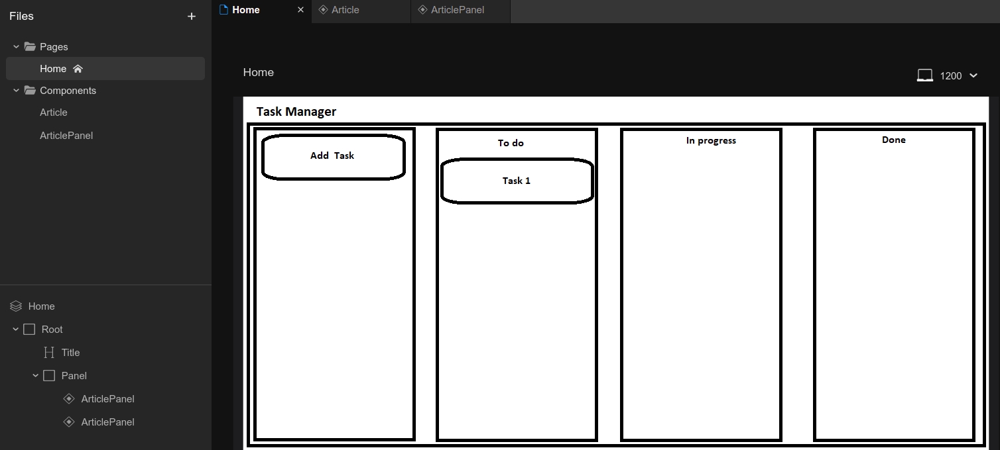

# otus-kotlin

Учебный проект курса
[Kotlin Backend Developer](https://otus.ru/lessons/kotlin/).
Поток курса 2025-08.

TaskManager -- это приложение, в котором пользователи могут создавать себе задачи, управлять их содержимым и статусами.

## Визуальная схема фронтенда

## Документация

1. Маркетинг и аналитика
   1. [Целевая аудитория](./docs/01-biz/01-studyProject-target-audience.md)
   2. [Заинтересанты](./docs/01-biz/02-studyProject-stakeholders.md)
   3. [Пользваотельские истории](./docs/01-biz/03-studyProject-bizreq.md)
2. Аналитика
    1. [Функциональные требования](./docs/02-analysis/01-studyProject-functional-requiremens.md)
    2. [Нефункциональные требования](./docs/02-analysis/02-studyProject-nonfunctional-requirements.md)
3. Архитектура
    1. [ADR](docs/03-architecture/01-studyProject-adrs.md)
    2. [Описание API](docs/03-architecture/02-studyProject-api.md)
    3. [Архитектурные схемы](docs/03-architecture/03-studyProject-arch.md)

# Структура проекта

## Подпроекты 

### Плагины Gradle сборки проекта

1. [build-plugin](build-plugin) Модуль с плагинами
2. [BuildPluginJvm](build-plugin/src/main/kotlin/BuildPluginJvm.kt) Плагин для сборки проектов JVM
2. [BuildPluginMultiplarform](build-plugin/src/main/kotlin/BuildPluginMultiplatform.kt) Плагин для сборки
   мультиплатформенных проектов

## Проектные модули

### Транспортные модели, API
